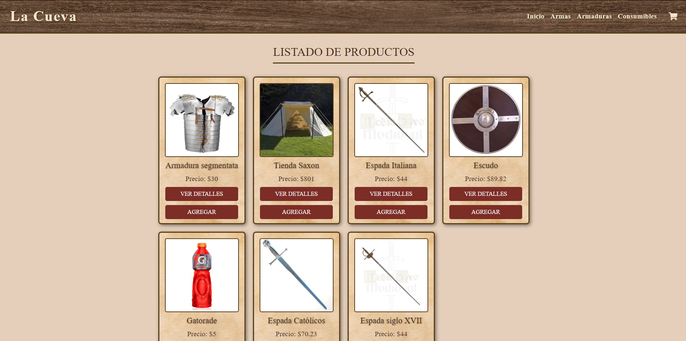
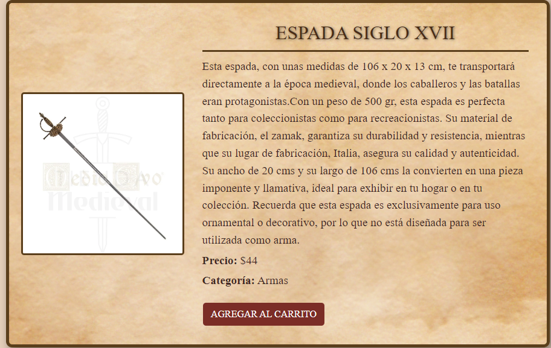

# 🛒 La Cueva - E-commerce React

## 📌 Descripción
**La Cueva** es una aplicación de e-commerce desarrollada con **React.js** y **Firebase**. Creada como proyecto para curso en la Carrera de Desarrollo Frontend React en Coderhouse. Permite a los usuarios navegar por un catálogo de productos, ver detalles de cada artículo, agregar productos al carrito y finalizar la compra mediante un formulario de checkout que genera una orden en Firestore. IMPORTANTE, tiene lo basico, faltarian detalles para un proyecto mas completo, como cuenta de usuario, contacto, cancelar orden...

## 🚀 Tecnologías utilizadas
- **React.js** - Framework de JavaScript para construir la interfaz de usuario.
- **React Router** - Manejo de rutas dentro de la aplicación.
- **Firebase Firestore** - Base de datos en tiempo real para gestionar productos y órdenes.
- **Bootstrap** - Estilos y diseño responsivo.
- **CSS Modules** - Estilización modular para mantener un código limpio y organizado.

## Screenshots

## Authors

- [@Matias Ruibal](https://github.com/Matias372)

## Environment Variables

Para mayor seguridad, es recomendable usar un archivo `.env` para almacenar las claves API y otros datos sensibles.

### Pasos:

1. **Crear archivo `.env`** en la raíz del proyecto.
2. **Agregar variables de entorno** (ejemplo):
   * "env
      API_KEY=tu-api-key
      DB_PASSWORD=tu-contraseña"
3. **Instalar dependencias**
    * Para Node.js: npm install dotenv
    * Para Python: pip install python-dotenv
4. **Cargar las variables**
    * Node.js:
        require('dotenv').config();
    * Python:
        from dotenv import load_dotenv
        load_dotenv()
5. **Añadir .env al `.gitignore´**
    * .env

¡Listo! Ahora tu proyecto manejará las variables de entorno de manera segura.